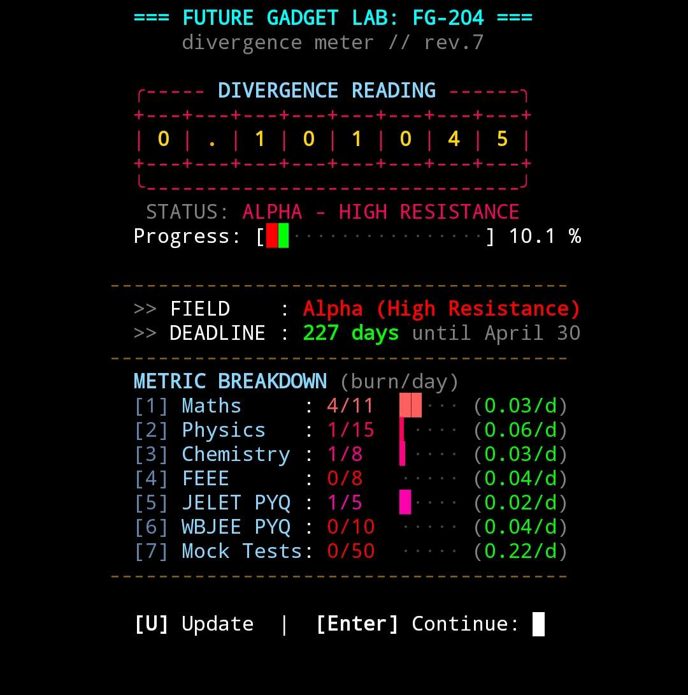

# FG-204 Divergence Meter Dashboard

A terminal-based study/task tracker inspired by Steins;Gate. It runs directly in your terminal, tracking your progression across different metrics toward a "Steins Gate" worldline by a specific deadline. 

Perfect for Linux and Termux (Android).




## Useful Commands

| Command | Description |
|---|---|
| `meter` | Boot the animated dashboard (full intro + nixie tube animation) |
| `meter -f`, `meter --fast` | Show the dashboard instantly, no animation |
| `meter -u`, `meter --update` | Open interactive mode to update metric values |
| `meter -e`, `meter edit` | Open the metrics config file in your `$EDITOR` |
| `meter add <idx> <val>` | Add `<val>` to metric `<idx>` (1-based). Example: `meter add 1 2.5` |
| `meter + <idx> <val>` | Shorthand for `add` |
| `meter -l`, `meter log` | View the worldline shift history log |
| `meter -h`, `meter --help` | Show the help message |


## Quick Install (Auto-Setup)

Open your terminal and run these commands. It will automatically download the code, compile it, and set it up to run instantly every time you open your terminal.

```bash
git clone [https://github.com/souvikun/Steins-gate-divergence-meter.git](https://github.com/souvikun/Steins-gate-divergence-meter.git)
cd Steins-gate-divergence-meter
chmod +x install.sh
./install.sh
